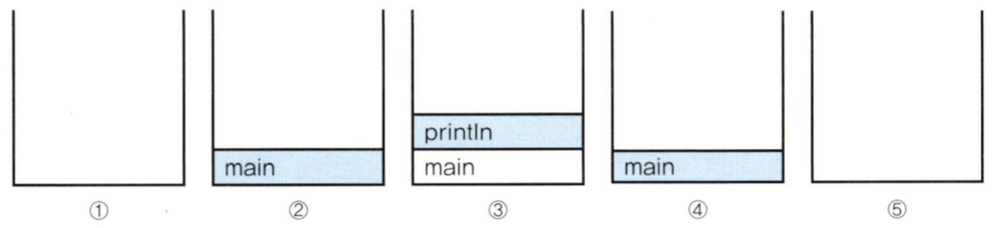

# 객체지향 프로그래밍 II

## Chapter 6 (20 ~ 41)
 
1. [호출스택 (call stack)](#호출스택-call-stack)  
2. [매개변수](#매개변수)
3. [static 메서드](#static-메서드)
4. [생성자](#생성자)
5. [this](#this)
6. [변수의 초기화](#변수의-초기화)

## 호출스택 (call stack)
- 개념적으로 매우 중요한 부분이지 않나 싶다.
- 모든 작업은 메모리 없이 할 수 없다. 따라서 메서드 작업에서도 메모리 공간활용은 필수적이다. 메서드가 호출되면, 호출스택에 호출된 메서드를 위한 메모리가 할당된다.
- 할당된 메모리에서는 메서드가 작업을 수행하는 동안 지역변수(매개변수 포함)들과 연산의 중간 결과 등을 저장하는데 사용된다.
- 메서드의 작업이 마치면, 할당되었던 메모리 공간이 해제된다.
- 힙 메모리 영역과 달리 스택은 GC를 통한 메모리 관리가 아닌 스택 자체로 메모리 관리가 된다.   
[Is the stack garbage collected in Java?](https://stackoverflow.com/questions/2447504/is-the-stack-garbage-collected-in-java)

```java
public static void main(String[] args) {
    System.out.println("Hello, World!");
}
```
</img>

## 매개변수
- 자바에서는 메서드를 호출할 때 매개변스로 지정한 값을 메서드의 매개변수에 복사해서 넘겨준다.
- 매개변수의 타입이 기본형(char, int, float, ...)일 때는 기본형 값이 복사되겠지만, 참조형(메모리주소)이면 참조형 값인 인스턴스의 주소가 복사된다.
- 매개변수를 참조형으로 선언한다면 전달한 변수의 값을 읽고 변경까지 가능하다.

## static 메서드
- 변수에서 처럼 메서드 앞에 static이 붙으면 클래스 메서드이고 붙어 있지 않으면 인스턴스 메서드이다.
- 메서드 중에서 인스턴스와 관계없는(인스턴스 변수나 인스턴스 메서드를 사용하지 않는) 메서드를 클래스 메서드로 정의한다.   
(반드시는 아니지만 일반적인 개발 방식이다.)
- 메서드 내에서 인스턴스 변수를 사용하지 않는다면, static을 붙이는 것을 고려한다. 인스턴스 메서드는 실행 시 호출되어야 할 메서드를 찾는 과정이 추가로 필요하기 때문이다.   
[Benefits of Static Methods](https://www.mygreatlearning.com/blog/static-method-in-java/#benefits-of-static-methods)

## 생성자
- 인스턴스가 생성될 때 호출되는 '인스턴스 초기화 메서드'이다.
- 인스턴스 변수의 초기화 작업에 주로 사용되며, 인스턴스 생성 시에 실행되어야 하는 작업을 위해서도 사용된다.
- 메서드처럼 클래스 내에서 선언하지만 리턴값이 없는 구조이다.
- 생성자도 오버로딩이 가능하다.

```java
class Point() {
    Point() {
        ...
    }

    Point(int x, int y) {
        ...
    }
    ...
}
```

- 생성자의 조건은 다음과 같다.
    1. 생성자의 이름은 클래스의 이름과 같아야 한다.
    2. 생성자는 리턴 값이 없다.
- 코드 내 생성자가 없다면 컴파일러는 자동으로 기본 생성자를 만들어준다.   
***다만, 생성자가 하나라도 있다면 컴파일러는 기본 생성자를 만들어주지 않는다.***
- ***연산자 new가 인스턴스를 생성하는 것이지 생성자가 인스턴스를 생성하는 것이 아니다.***

## this
- this는 객체 자신을 가리키는 참조변수이다.
- 보통 생성자나 메서드 내에서 매개변수 혹은 지역변수를 사용할 때, 멤버변수와 이름이 동일해서 구별이 어려운 경우 사용한다.

```java
void Car(String color, String gearType, int door) {
    this.color = color;
    this.gearType = gearType;
    this.door = door;
}
```

- this를 통한 접근은 인스턴스 멤버만 가능하고 클래스 멤버에는 불가능하다. (static)
- this에 괄호를 붙여 메서드 호출처럼 작성하면 이는 생성자 호출을 의미한다. 이를 통해 한 생성자에서 다른 생성자를 호출할 수 있다.   
***반드시 첫 줄에 작성해야만 호출이 가능하다.***

```java
Car(String color) {
    this(color, "auto", 4);
}
```

## 변수의 초기화
- 클래스의 멤버변수는 자동적으로 변수의 자료형에 맞는 기본값으로 초기화가 된다.
- ***지역변수는 사용하기 전에 반드시 초기화를 해야한다.***
- 멤버변수의 초기화는 순서가 존재한다.
    1. 자동 초기화
    2. 명시적 초기화
        - 변수를 선언과 동시에 초기화하는 것을 명시적 초기화라고 한다.
        ```java
        class Car {
            int door = 4;
            Engine e = new Engine();
            
            ...
        }
        ```
    3. 초기화 블럭
        - 초기화 블럭에는 '클래스 초기화 블럭'과 '인스턴스 초기화 블럭'이 있다.
            1. 클래스 초기화 블럭
                - 클래스 변수의 복잡한 초기화에 사용된다.
                
            2. 인스턴스 초기화 블럭
                - 인스턴스 변수의 복잡한 초기화에 사용된다.
        - 클래스 내에 블럭 {}을 만들고 그 안에 초기화 코드를 작성하면 된다. 클래스 초기화 블럭은 블럭 앞에 static만 덧붙이면 된다.
        ```java
        class Example {
            static {
                System.out.println("static { }");
                // 클래스 초기화 블럭
            }

            {
                System.out.println("{ }");
                // 인스턴스 초기화 블럭
            }

            ...
        }
        ```